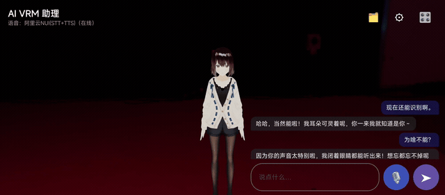

# vrm-android

[English](README.md) | [中文](README.zh-CN.md) | **日本語**

純 Kotlin による **VRM 1.0 解析・ランタイムライブラリ**（コードネーム vrm-android / vrmruntime）です。Android アプリが VRM 仮想ヒューマンモデルを読み込み、その基本動作（ボーンマッピング、表情、スプリングボーン物理、VRMA アニメーションのリターゲティング、視線追従（LookAt））を駆動できるようにします。

レンダリング層は **Google Filament**（SceneView の Engine / ModelLoader 経由で接続）を基盤とし、Unity / ゲームエンジン / JNI ゲームフレームワークには依存しません。コアライブラリ `:vrm-core` は純 Kotlin/JVM で Android 依存ゼロ、JUnit5 による高速テストが可能です。

移植の青写真：[three-vrm](https://github.com/pixiv/three-vrm)（TypeScript）。規格：[VRM 1.0 仕様](https://github.com/vrm-c/vrm-specification)（重点は `VRMC_vrm-1.0`、`VRMC_vrm_animation-1.0`、`VRMC_springBone-1.0`、`VRMC_materials_mtoon-1.0`）。

## プロジェクト構造

```
vrmruntime/
├── vrm-core/                    純 Kotlin JVM ライブラリ（maven 配布可）
│   └── src/main/kotlin/dev/vrm/runtime/core/
│       ├── gltf/                 GLB 解析 + glTF 2.0 データクラス
│       ├── vrm/                  VRMC_vrm / VRMC_springBone / VRMC_materials_mtoon データクラス + VrmLoader
│       ├── humanoid/             HumanBone マッピング / VRMRig / ノーマライズドリグ / VRMHumanoid
│       ├── expression/           ExpressionManager / ExpressionLoader / 3 種の bind
│       ├── vrma/                 VRMA 解析 / リターゲット clip 構築 / KeyframeTrack
│       ├── springbone/           Verlet スプリングボーン / collider / manager / loader
│       ├── mtoon/                MToon マテリアルパラメータモデル
│       ├── lookAt/               LookAt コントローラー / bone+expression applier / range map
│       ├── controller/           AvatarController 命令的 API（xlunar 参照）+ AvatarConfig リソースマニフェスト
│       └── math/                 Vec3 / Quat / Mat4（three.js セマンティクス、ゼロ依存）
├── vrm-adapter/                 Android ライブラリ（Filament/SceneView バインド層、vrm-core の上位に位置）
│   └── src/main/java/dev/vrm/runtime/adapter/
│       ├── AvatarEngineController.kt   エンジンコントローラー（AvatarBinding 実装 + 口型）
│       ├── AvatarRenderer.kt           adapter のメインエントリ（loadModel/loadModelAsync / applyStage / update）
│       ├── StageConfig.kt              ライティング/シーン設定
│       ├── VrmAnimationPlayer.kt       リアルタイム VRMA プレイヤー（TransformManager でボーン書き込み）
│       └── filament/                   FilamentNodeTransformStore / SpringBoneStore / MToonMaterialApplier
├── app/                         メイン横画面 demo（Compose + SceneView/Filament、:vrm-adapter に依存）
│   └── src/main/java/dev/vrm/runtime/demo/
│       ├── VrmDemoScreen.kt            xlunar スタイル：左ビューポート + 右タブ操作パネル
│       ├── DemoAssets.kt               モデル/VRMA/表情リソースマニフェスト
│       └── MainActivity.kt
├── vrm-character/               エンジン非依存のキャラクター挙動層（JVM：感情、動作、口型、待機、徜徉 AI、SceneConfig）
│   └── src/main/kotlin/dev/vrm/runtime/character/
└── demoPhone/                   携帯縦長の AI 仮想ヒューマンアシスタント（Compose + SceneView）
    └── src/main/java/dev/vrm/runtime/phonephone/
        ├── PhoneDemoScreen.kt          縦長 UI + カメラ + STT/TTS
        ├── PhoneViewModel.kt           LLM 対話 + 表情/ジェスチャー/アニメーション配信 + 口型
        ├── PhoneAssets.kt              携帯用アセット一覧（モデル / 音声 / 環境）
        ├── brain/                      AssistantBrain + KeywordAssistantBrain
        └── voice/                      NUI（Alibaba）STT/TTS + 再生ゲート
```

> 注：`vrm-character` はエンジン非依存の待機/動作層で、両デモで共用します。`demoPhone`
> は縦長 AI アシスタント app で、クローズドソースの阿里雲 `nuisdk-release.aar` を同梱
> しているためローカルの開発専用（公開/配布対象ではありません）。

## 環境

- JDK 17、Android API 26+
- Kotlin 2.2.x、AGP 8.12.x、Gradle 8.13
- レンダリング：SceneView 2.3.3（内蔵 Filament 1.68.2）
- JSON：kotlinx.serialization 1.7.3
- テスト：JUnit5 + 公式 Seed-san.vrm fixture

## 導入ガイド（ライブラリの利用）

### 0. 依存座標（Maven 配布）

3 つのライブラリすべてが `maven-publish` 済みです（groupId `dev.vrm.runtime`）：

| モジュール | 座標 | タイプ | 公開コマンド                                  |
|---|---|---|---|
| vrm-core | `dev.vrm.runtime:vrm-core:1.0.0` | jar | `./gradlew :vrm-core:publishToMavenLocal`     |
| vrm-character | `dev.vrm.runtime:vrm-character:1.0.0` | jar | `./gradlew :vrm-character:publishToMavenLocal` |
| vrm-adapter | `dev.vrm.runtime:vrm-adapter:1.0.0` | aar | `./gradlew :vrm-adapter:publishToMavenLocal`   |

ホストプロジェクト（JVM / Android）側の依存：

```kotlin
// settings.gradle.kts で mavenCentral + mavenLocal() にアクセスできる必要があります
implementation("dev.vrm.runtime:vrm-core:1.0.0")        // 純粋エンジン（JVM/Android）
implementation("dev.vrm.runtime:vrm-adapter:1.0.0")    // Filament/SceneView バインド（Android）
implementation("dev.vrm.runtime:vrm-character:1.0.0")  // キャラクター挙動層（JVM/Android）
```

公開構成：jar/aar + pom + Gradle module metadata は `publishing { MavenPublication(...) }` が自動生成します。リモートリポジトリ（例：Maven Central）へプッシュするには `publishing.repositories` に該当リポジトリを追加し、必要に応じて署名を設定します。

### 1. VRM の解析

```kotlin
import dev.vrm.runtime.core.vrm.VrmLoader

val bytes: ByteArray = ... // .glb / .vrm ファイルのバイト列
val vrm = VrmLoader.load(bytes)
// vrm.gltf          下層の glTF
// vrm.vrm           VRMC_vrm 拡張（humanoid/lookAt/expressions/meta）
// vrm.springBone    VRMC_springBone 拡張
// vrm.mtoon         material index -> VRMC_materials_mtoon
// vrm.vrmAnimation  VRMC_vrm_animation（.vrma ファイル用）
```

### 2. Humanoid + 表情の構築（NodeTransformStore の提供が必要）

```kotlin
import dev.vrm.runtime.core.humanoid.VRMHumanoid
import dev.vrm.runtime.core.expression.ExpressionLoader

// store はレンダリングエンジンのノードグラフを抽象化します。demo では FilamentNodeTransformStore を使用
val humanoid = VRMHumanoid.fromVrm(vrm.gltf, vrm.vrm!!, store)
val expressionManager = ExpressionLoader(bindProvider).load(vrm.gltf, vrm.vrm!!)
```

コアライブラリはエンジン非依存です。`NodeTransformStore`（getLocal*/getWorldMatrix/parentNodeIndex）と `ExpressionBindProvider`（morphTargetChannel / materialColorAccess / textureTransformAccess）はホスト側が実装します。

### 3. LookAt 視線追従

```kotlin
import dev.vrm.runtime.core.lookAt.VrmLookAtLoader

val lookAt = VrmLookAtLoader(humanoid, expressionManager, store).load(vrm.vrm!!)
lookAt.target = Vec3(x, y, z)   // ワールド座標のターゲット点
// 毎フレーム：
lookAt.update(deltaSeconds)     // autoUpdate=true のとき target へ向けて回転し、表情/ボーンへ書き込む
```

Seed-san など多くのモデルは `expression` 型の LookAt を使用します（lookUp/Down/Left/Right の表情を駆動）。`bone` 型は leftEye/rightEye ボーンを直接回転します。

### 4. スプリングボーン

```kotlin
import dev.vrm.runtime.core.springbone.SpringBoneLoader

val springManager = SpringBoneLoader(vrm.gltf, vrm.springBone!!, springStore).load()
// 毎フレーム：
springManager.update(deltaSeconds)
```

### 5. VRMA アニメーションの再生（モデル間リターゲット）

```kotlin
import dev.vrm.runtime.core.vrma.VrmAnimationLoader
import dev.vrm.runtime.core.vrma.VRMAnimationClipBuilder

val vrma = VrmLoader.load(vrmaBytes)
val ext = vrma.vrmAnimation!!
val bin = vrma.binary?.let { ByteBuffer.wrap(it).order(ByteOrder.LITTLE_ENDIAN) }
val animation = VrmAnimationLoader(vrma.gltf, bin, ext).loadAll().first()
val clip = VRMAnimationClipBuilder(animation, humanoid, expressionManager).build()
// clip.tracks はエンジン非依存の KeyframeTrack です：
//   Normalized_<bone>.quaternion / .position
//   <expressionName>.weight
```

demo の `VrmAnimationPlayer` はこれらの track を再生する最小実装です。

### 6. 数学ライブラリ

`core/math` は three.js セマンティクスの `Vec3`/`Quat`/`Mat4`（可変オブジェクト、copy() スナップショット）をゼロ依存で提供します。内部のすべての VRM 処理はこれの上で動作します。

### 7. AvatarController（命令的制御層、xlunar-ai-avatar 参照）

`core/controller` は「モデル選択 / アニメーション切替 / 表情駆動」などの操作をエンジン非依存の命令的 API にカプセル化します。demo は `AvatarBinding` インターフェースを実装するだけで駆動できます：

```kotlin
import dev.vrm.runtime.core.controller.*

// 1. ホストが AvatarBinding を実装（demo では VrmController が実装済み、Filament と接続）
val binding: AvatarBinding = myController

// 2. リソースマニフェストの設定（モデル/アニメーション/表情/ポーズ）
val config = AvatarConfig(
    models = listOf(ModelPreset("seed", "Seed-san", "avatars/Seed-san.vrm")),
    animations = listOf(AnimationPreset("wave", "Wave", "animations/wave.vrma")),
)

// 3. コントローラーの作成
val avatar = AvatarController(binding, config)

// 4. 命令的駆動
avatar.setModel("B");            // モデル切替
avatar.playVrma("wave");         // アニメーション再生（app id または元の source で指定）
avatar.setExpression("happy");   // 表情
avatar.execute(AvatarCommand.ResetExpression)
avatar.batch(listOf(...))        // 同時に複数実行
avatar.queue(listOf(...))        // 順次キュー（Wait 対応）
avatar.on(AvatarEventType.STATE_CHANGE) { event -> ... }   // イベント購読
avatar.onVrmaComplete()          // プレイヤー終了後にホストからコールバック
```

コマンド型（`AvatarCommand`）：SetPose / SetHandGesture / SetBodyGesture / SetBodyMotion / SetExpression / PlayVrma / SetSequence / Wait / Reset / ResetPose / ResetExpression / StopVrma / StopSequence / RawPose / RawExpression。

## デモアプリ

`app` モジュールは完全に実行可能な横画面 Compose デモです：

- **モデルセレクター**：42 個の VRM 1.0 モデルを切替（`avatars/` の 8 サンプル + `models/` の 34 キャラクター）
- **Pose**：静的ポーズ、ジェスチャーエイリアス、ボディモーションの入口、ポーズのリセット
- **Combos**：多段階ポーズ + 表情の演出（friendly greeting / thinking eureka / explaining など）
- **VRMA**：20 個の VRMA、リアルタイム再生（GLB ベイクなし）、手動 loop のオン/オフ、停止
- **Face**：標準 VRM 表情を項目ごとに 0..1 スライダーで操作（happy / sad / mouth / blink / lookAt）
- **Scene**：環境光、方向光、カメラ距離、自動 LookAt、環境切替（Studio / Ferndale / Brown）
- **スプリングボーンのオン/オフ** / **LookAt 追従**：髪・スカートの物理、視線追跡

すべてのアニメーション/ポーズ/組み合わせは**リアルタイム VRMA 駆動**（`VrmAnimationPlayer`）で、
毎フレームボーンのローカル回転を `TransformManager` へ書き込み、`updateBoneMatrices()` で
スキニングを駆動します——**GLB ベイクなし・モデル再構築なし・再ロード競合なし**。アニメーションは
フェードイン/アウトが滑らかで、再生後は自然な relaxed 立ち姿勢（呼吸 + ランダムな瞬き + 微細動作）へ
戻り、ワンショット clip は最終フレームに凍結せずに緩やかに復帰します。

デモアセット：`app/src/main/assets/avatars/`（8 サンプル VRM）、`models/`（34 キャラクター VRM）、
`animations/`（20 VRMA）、`environments/`（3 組の IBL＋skybox）。

> ⚠️ **環境マップは必須アセットです**：demo は `assets/environments/*/*_ibl.ktx` + `*_skybox.ktx`
> （Studio / Ferndale Studio / Brown Photo Studio）を IBL 環境光として利用します。このファイルが
> ないとシーンに環境光がなく、**モデルが黒く描画されます**。
>
> ⚠️ メイン demo は横画面です。状況に応じて AndroidManifest で `screenOrientation`（または
> `unspecified`）を設定してください。

ビルド：`./gradlew :app:assembleDebug`、APK は `app/build/outputs/apk/debug/` に出力されます。

## demoPhone（AI 仮想ヒューマンアシスタント）

同じ `vrm-adapter` を土台とした**縦長・音声駆動のアシスタント app**（Compose + SceneView）——
音声対話（阿里雲 STT/TTS）で、仮想ヒューマンがリアルタイムに口型同期・表情・ジェスチャー・
LLM が選んだ VRMA アニメーションを再生します。



ハイライト：

- **音声対話ループ**：STT → AI 応答 → TTS（字幕フレームで口型駆動）。
- **LLM 表情/ジェスチャー/アニメーションプロトコル**：system prompt が、現在サポートしている
  プリセット群（表情・ジェスチャー・20 VRMA）から標準の `[表情:xxx]` / `[動作:xxx]` タグを選ぶよう
  LLM に要求。クライアントは発話前にタグを除去し、対応する顔/ジェスチャー/clip を再生します
  （タグが無い場合は本文のキーワードからも対応を推測）。
- **口型同期**は阿里雲の字幕タイムスタンプを基に、実際の再生開始点を基準に少量の先行オフセットを
  加えて音声に一致させます。
- 完全な 10 秒エフェクト録画は `demo/demophone_effect_10s.mp4` を参照。

クローズドソースの阿里雲 `nuisdk-release.aar` を同梱するため、`demoPhone` は公開/配布
モジュール群には含まれません（ローカル開発専用）。

## テスト

```bash
./gradlew :vrm-core:test --console=plain
```

95 個のテスト全緑（17 テストクラス）、カバレッジ：

| モジュール | テストクラス | 件数 |
|---|---|---|
| glb + VRM データ層 | VrmLoadingTest（Seed-san の全フィールド解析） | 4 |
| Humanoid | VRMHumanoidTest（ボーンマッピング / required 検証 / ノーマライズドリグ） | 4 |
| Humanoid | TwistHumanoidMapTest | 1 |
| Humanoid | UpdateRestRoundtripTest（ポーズ書き戻し後も rest ポーズが往復一致する検証） | 1 |
| Expressions | ExpressionManagerTest（preset 解析 / クランプ / override グループ / morph 書き込み） | 16 |
| Expressions | MaterialColorBindTest（materialColorBinds → baseColor） | 2 |
| VRMA | VrmAnimationLoaderTest（合成 VRMA 解析 + Seed-san へのリターゲット） | 4 |
| VRMA | RealVrmaDiagnosticTest（実在 test.vrma のチャンネル診断） | 1 |
| VRMA | TwistArmPoseTest（回転アニメ中の腕のワールド座標） | 1 |
| SpringBone | SpringBoneColliderTest（sphere/capsule の正確な期待値） | 6 |
| SpringBone | SpringBoneTest（Verlet 垂下 / 骨長保存） | 4 |
| MToon | MtoonTest（10 マテリアルの解析 / パラメータ / renderOrder） | 6 |
| LookAt | LookAtTest（range map / 角度ユーティリティ / applier の符号 / loader / 挙動） | 18 |
| Controller | AvatarControllerTest（コマンドキュー / イベント / 状態 / batch） | 13 |
| Guards | VrmLoaderGuardTest（空入力 / 非 GLB / VRM 0.x） | 6 |
| Guards | NodeTransformStoreGuardTest（範囲外の node index） | 6 |
| math | Vec3ApiTest（three.js セマンティクス API） | 2 |

## 実装済み機能

- [x] GLB 解析（ヘッダー + JSON/BIN chunk）
- [x] VRMC_vrm：humanoid（52 標準ボーン、17 required 検証）、expressions（18 preset + custom）、lookAt、meta、firstPerson データクラス
- [x] VRMC_springBone：collider（sphere/capsule）、joint、group、center
- [x] VRMC_materials_mtoon：パラメータモデル（シェーディング係数 / テクスチャ index / outline / renderOrder）
- [x] VRMC_vrm_animation（.vrma）：humanoid / expressions / lookAt トラック + リターゲット clip
- [x] Humanoid：raw rig の読み書き / ノーマライズドリグ / rest 姿勢の捕捉
- [x] Expressions：ウェイトのクランプ / isBinary / override グループ（blink/lookAt/mouth）/ morph+マテリアル+UV bind
- [x] SpringBone：Verlet 積分 / stiffness / gravity / drag / 衝突押し出し / 深さソート
- [x] MToon：sRGB opt-in 変換、renderOrder、Filament セルシェーダー
- [x] LookAt：yaw/pitch / bone + expression applier / range map / faceFront
- [x] リアルタイム VRMA 再生（TransformManager ボーン書き込み + updateBoneMatrices）+ スムーズな待機/遷移
- [x] demoPhone：STT/TTS、LLM タグ解析、口型同期

## 既知の未対応項目 / 制限

**機能面**
- **VRM 1.0 のみ**対応（1.0-beta 含む）。VRM 0.x とは互換性がありません。
- VRM の読み取りのみで書き出しは不可。編集機能はありません。
- MToon はパラメータモデル + 近似再現であり、100% ピクセル単位の再現ではありません（レンダリング基準は three-vrm）。レンダリング層は matc でプリコンパイルした `mtoon_{opaque,masked,transparent}.filamat`（unlit + 手動セル/toon ライティング）で gltfio のデフォルト PBR を置き換え、マテリアルごとの alphaMode に応じて blending バリアントを選択します。近似実装：baseColor / shade 色 + shadingShift/Toony + 一方向光のみをマップし、rim / matcap / outline / UV アニメーションなど MToon 固有のチャンネルは未実装（解析はするがシェーダーでは未使用）。
- VRMA の編集は行わず、ランタイム再生のみ対応。
- glTF の制約（constraint / KHR 拡張）は解析しません。VRMC_node_constraint は未実装です。

**エンジン接続面（demo の Filament バインド）**
- **PNG テクスチャは MToon 経路では対応済み、gltfio の既定経路では未対応（解決済み）**：gltfio 1.68 の `ResourceLoader` には `addTextureProvider` がなく、filament-utils には ImageDecoder がないため、`image/png` テクスチャを使用する VRM（例：Seed-san）は既定の gltfio レンダリングでは素色・グレーのままです。ただし demo の MToon 経路（`MToonMaterialApplier`）では **GLB の BIN chunk から PNG を取り出し → BitmapFactory でデコード → Filament Texture に変換**する独自経路を実装済みで、MToon を有効にすると PNG テクスチャが正常に着色されます。
- `FilamentNodeTransformStore.parentNodeIndex` を修正済み：gltf nodes を渡して nodeIndex→parent のマッピングを構築し、`parentNodeIndex` が実際の親子関係を返すようにしました（bone 型 LookAt / springbone center / ノーマライズドリグの親ワールド回転補正を修正）。
- VRMA の lookAt トラック（`lookAt.quaternion`）は `VrmAnimationPlayer` で消費済み：ワールド空間の視線 quaternion をサンプリング → yaw/pitch に変換 → VrmLookAt コントローラーへ適用（`VrmAnimationPlayer.apply`。lookAt が渡された場合に有効）。
- 表情のマテリアルカラー / UV 変換 bind は、demo の `FilamentExpressionBindProvider` でマテリアル属性ごとに実装しています。該当属性がシェーダーで宣言されていない場合はその bind をスキップします。
- **VRoid/xlunar モデルのスケルトン根チェーン問題（解決済み、live 駆動）**：初期の gltfio は「独立スケルトン根 + 単一共有 skin」構造の関節ワールド行列を誤って計算していました。現在は **live VRMA 駆動**に変更済み——`AvatarRenderer.loadModel` は通常の GLB を読み込み、アニメーション/ポーズ/組み合わせはすべてリアルタイム VRMA プレイヤー + `TransformManager` によるボーン書き込み + `updateBoneMatrices()` で駆動します（公式サポートされたチャンネル）。**GLB ベイクなし・ModelNode 再構築なし・再ロードウィンドウなし**。ベイクチャンネル（`VrmaBake` / `loadModelWithClips` / `switchClip`）は削除済みです。
- **Directional Light が MToon/トゥーン素材に無効（正しい挙動）**：VRoid/キャラクターモデルのマテリアルはすべて `KHR_materials_unlit` / MToon のトゥーン素材で、**方向光に反応しません**（トゥーン描画の特性で、xlunar/three-vrm も同様）。Scene タブの ambient + directional の 2 つのスライダーは現在**環境光（IndirectLight）の合計輝度として統合**し、画面の明暗を制御します：`合計輝度 = ambient*400k + dir*250k`。方向光を実際に有効にするにはマテリアルを PBR に変更する必要があります（トゥーン表現が崩れます）。
- **リアルタイム lookAt は live 経路で正常**：live プレイヤーは毎フレームワールド視線 quaternion を yaw/pitch に変換して VrmLookAt へ書き込み、リアルタイムに反映されます（ベイク方式の「Animator が全ボーンを管理する」制約は解消済み）。
- スプリングボーンの衝突は 3 つの球体で近似（capsule は 2 点 + 半径）。three-vrm の挙動と一致します。

- **VRoid の髪が「顔に被る」原因：lookAt による継続的な頭の回転 + ベイクした hair-lock がローカル rest のみをロック**。ベイクした clip には humanoid ボーンしか含まれず、スプリングボーン関節（VRoid_B の 47 本の HairJoint）は clip に含まれません。各 HairJoint の **rest ローカル回転**を一定の track（`hairLock_*`）としてベイクしたため、髪が大きな回転で「レーザーのように飛ばされる」ことはなくなりました。ただし HairJoint は `J_Bip_C_Head` の子なので、**head が回転すると髪は head のワールド向きを継承**します—— demoPhone が既定で有効にしている lookAt が毎フレーム head を円周運動させ（`target = head + 0.35·sin / 0.2·cos / +0.6`）、髪が head の揺れに合わせて断続的に顔に被ります。**demoPhone は現在 lookAt を既定で無効にしています（`PhoneViewModel.lookAtEnabled=false`）**。有効にするには、ベイク経路とは別の独立したボーンチャンネルを用意して髪の「ワールド向きのロック」を実現する必要があります。

## 性能 / プラットフォーム

- すべての Filament JNI 呼び出しはメインスレッドで行う必要があります。モデル/VRMA の解析は IO dispatcher での実行を推奨します。
- ライブラリ自体は Compose に依存しません。demo が Compose を使うだけで、ライブラリは純 Kotlin の API です。

## License

このライブラリは **MIT License** の下で配布されています。詳細は [LICENSE](LICENSE) ファイルを参照してください。

### Third-party notice

`vrm-core` の主要部分（humanoid、expressions、lookAt、spring-bone physics、MToon パラメータモデル、VRMA リターゲティング、math）は [three-vrm](https://github.com/pixiv/three-vrm) からの移植であり、同ライブラリは MIT License（Copyright (c) 2019-2026 pixiv Inc.）で配布されています。MIT の条項に従い、著作権表示と本許可表示はソースコード内に保持されています（`Port of three-vrm...` の doc comment を参照）。

`vrm-adapter`（Filament/SceneView バインディング）と `app`（demo）は vrm-core の上に構築された独自実装であり、同じ MIT License を引き継ぎます。

命令的なアバター制御層（`AvatarController` / `AvatarCommand` / `AvatarConfig` / `AvatarBinding`）と、demo のステージ/ポーズ/ジェスチャー/コンボプリセットは [xlunar-ai-avatar](https://github.com/iamenahs/xlunar-ai-avatar) からの移植であり、同様に MIT License（Copyright (c) 2024 VaultX.technology）で配布されています。MIT の条項に従い、著作権表示はソースコード内に保持されています（`Port of xlunar...` の doc comment を参照）。

### Model assets

このライブラリにモデルアセットは同梱されていません。demo のサンプルモデル（VRM Consortium 提供の `Seed-san.vrm`、three-vrm の examples 由来の `test.vrma`）はそれぞれの原作者に帰属し、デモンストレーション目的でのみ含まれています。商用利用の前に各アセットのライセンスを確認してください。
